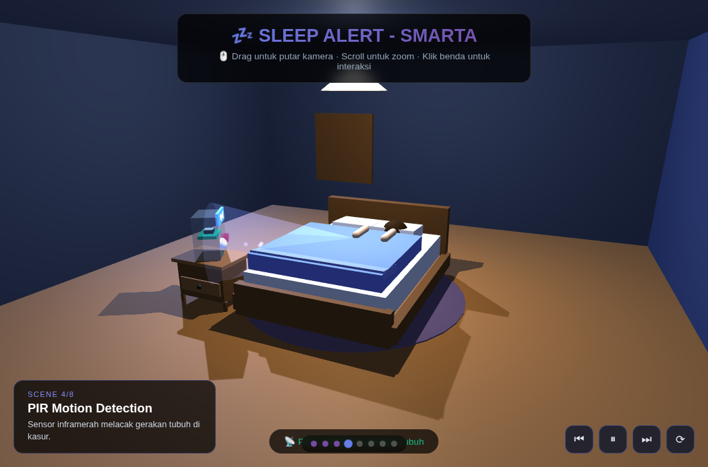

# 💤 Sleep Alert - SMARTA Device

Interactive 3D bedroom scene built with **Three.js** that tells the story of an IoT sleep-monitoring device called **SMARTA** (ESP32 + PIR motion sensor + microphone).

## 🎬 Storyline (8 Scenes)

1. **Meet SMARTA** — IoT device: ESP32 + PIR + Mic untuk monitoring tidur
2. **Bedroom Setup** — SMARTA memantau dari meja nakas
3. **User Falls Asleep** — Monitoring dimulai otomatis saat user tidur
4. **PIR Motion Detection** — Sensor inframerah melacak gerakan tubuh di kasur
5. **Sound Monitoring** — Mic menangkap noise & snoring di sekitar
6. **ESP32 Processing** — Data diproses lokal tiap 30 menit
7. **Cloud Transmission** — Hasil diunggah aman via WiFi ke server
8. **Sleep Analysis Complete** — Laporan lengkap tersedia di aplikasi mobile

## ✨ Fitur

- 🛏️ Kamar tidur 3D: kasur, selimut, meja nakas, karpet, jendela, lampu gantung
- 🤖 Device SMARTA interaktif: PIR beam, mic sound waves, LED, layar, mata
- 😴 Model user berbaring di kasur dengan animasi nafas
- 📡 Partikel data mengalir **person → device** (hasil sensing dikirim ke SMARTA)
- 🎥 Kamera otomatis berpindah per scene + OrbitControls (drag / scroll)
- 🖱️ Klik benda interaktif: lampu (on/off), kasur, meja nakas (laci), user, SMARTA
- ▶️ Kontrol storyline: play/pause, skip scene, progress dots, reset kamera
- 📊 Overlay statistik tidur di scene terakhir

## 🚀 Cara Menjalankan

Cukup buka `index.html` di browser, atau serve secara lokal:

```bash
python3 -m http.server 8080
# buka http://localhost:8080
```

Semua library (Three.js r147 + OrbitControls) dimuat dari CDN jsdelivr — butuh koneksi internet.

## 🧠 Teknologi

- [Three.js r147](https://threejs.org/) — WebGL 3D
- OrbitControls (non-module build)
- Vanilla JavaScript, tanpa framework

## 📸 Preview


